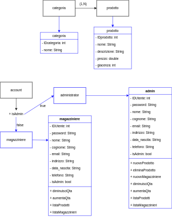

{width=250, align=center}
\newpage

# SRS
Il SRS, *Software Requirements Specifications* è un documento che descrive il sistema software sviluppato, elencandone i functional e i non functional requirements. Sono anche indicati i casi d'uso.

## Introduzione
Il progetto nasce con lo scopo di gestire il magazzino di una piccola realtà aziendale, le cui principali esigenze sono quelle di tenere traccia delle giacenze in maniera precisa, anche scollegata dal resto degli uffici in azienda. Come specificato dallo stakeholder, l'azienda si occupa di montaggi di attrezzature, i prodotti in magazzino non vengono propriamente venduti. Questo comporta quindi che l'applicativo avrà un uso interno limitato al reparto di magazzino, al fine di monitorare l'assenza temporanea di attrezzature, senza avere quindi una reale necessità di comunicare con altri settori aziendali.

## Descrizione generale
La gestione del magazzino è un aspetto chiave all'interno di un'azienda, anche se non si tratta di prodotti da vendere. L'applicativo sviluppato permette una gestione rapida e univoca di tutte le attrezzature presenti in magazzino. A causa dell'utilizzo finale e dei *domain requirements* rilevati a colloquio con lo stakeholder, si è pensato a un'interfaccia di gestione dell'applicativo da riga di comando, in quanto durante le operazioni di gestione gli utenti identificano un prodotto in base al suo codice interno identificativo, e non prestano attenzione ad altri dettagli quali foto o altri elementi grafici.

# Le funzionalità e i requisiti

- ogni magazziniere dovrebbe avere il proprio accont personale;
- ogni magazziniere dovrebbe essere in grado di gestire *la quantità* di un singolo prodotto;
- ogni magazziniere dovrebbe essere in grado di conoscere i dati identificativi dei colleghi;
- i magazzinieri non dovrebbero essere in grado di modificare la composizione del magazzino, ovvero aggiungere, modificare o eliminare i prodotti;
- un nuovo magazziniere può registrarsi e accedere al sistema;
- l'accesso al sistema è garantito da un'utenza (tipo account);
- il suddetto deve essere personale, e le informazioni di accesso devono essere conservate in maniera criptata;
- la gestione degli account, e le informazioni a loro connesse devono rispettare la triade CIA;
- dovrebbe essere prevista un'utenza con privilegi aggiuntivi capace di effettuare operazioni non consentite ai magazzinieri;
- i prodotti devono poter essere identificati in maniera univoca;
- devono essere registarte tutte le informazioni riguardanti un prodotto
  - il suo prezzo, in caso di danneggiamento o smarrimento
  - una breve descrizione, al fine di conoscere informazioni aggiuntive
  - un nome generico per un eventuale controllo secondario di tipo visivo

# Elicitation e attività di supporto
Come attività di supporto all'elicitation, ovvero la raccolta di informazioni, è stato scelto un approccio di tipo *brainstorming*, in quanto la strategia di *focus group* è stata ritenuta infattibile a causa del ridotto numero di partecipanti al progetto (2).

## Il brainstorming
Nella prima fase, ovvero quella di storm, sono state raccolte le informazioni partendo dalla conoscenza delle funzionalità da implementare, e delle caratteristiche del dominio in esame. Le idee genarate dalla prima fase sono state successivamente filtrate in quella che è la seconda fase, ovvero quella di calm.

Idee similari sono state unite e sono stati definiti e applicati i criteri di accettabilità.

# I casi d'uso 
I casi d'uso, o use cases, sono strettamente collegati con i requisiti, in quanto ogni requirement deve essere coperto da un caso d'uso.

La loro nomenclatura deve essere auto esplicativa, per questo motivo infatti uno use case è chiamato come l'azione che compie nei confronti di una entità.

Per semplicità di rappresentazione può essere utilizzato UML.

## Use case

|**registraMagazziniere**|                                                                                            |
| ------------------------ |------------------------------------------------------------------------------------------- |
| Descrizione       | Permette la registrazione di un nuovo magazziniere e ne inserisce i dati all'interno di un database       |
| Attore            | Un nuovo utente, un magfazziniere o un amministratore                                |
| Frequenza d'uso   | Ogniqualvolta un magazziniere deve essere aggiunto al database                                    |
| Svolgimento       | Vengono richieste le informazioni identificative del magazziniere, insieme a una password per gli accessi futuri |
| Eccezioni gestite | Se la mail risulta essere già registrata viene comunicato, se la password non rispetta le condizioni viene comunicato, la mail deve corrispondere a un formato mail. È previsto il controllo con una regex |

<!--
||
|------------------------| ----------------------------------------------------------------------------------------|
|Descrizione||
|Attore||
|Frequenza d'uso||
|Svolgimento||
|Eccezioni gestite||
-->

|**loginUtente**|
|------------------------| ----------------------------------------------------------------------------------------|
|Descrizione|Permette a un utente registrato in precedenza, e quindi presente all'interno del database, di effettuare l'accesso al sistema con le sue credenziali di mail e password|
|Attore|Un qualsiasi utente già registrato|
|Frequenza d'uso|Ogniqualvolta un utente ha necessità di operare con la piattaforma al fine di effettuarvi l'accesso, per visionare o modificarne i dati|
|Svolgimento|Vengono richieste mail e password, viene controllata la loro correttezza e la loro presenza all'interno della base di dati. In caso di username o password errata viene visualizzato un errore|
|Eccezioni gestite|La password non può essere vuota|

|**incrementaQta**|
|------------------------| ----------------------------------------------------------------------------------------|
|Descrizione|Permetyte di incrementare la quantità di un prodotto|
|Attore|Un qualsiasi utente|
|Frequenza d'uso|Ogniqualvolta vi è la necessità di incrementare la quantità di un elemento del magazzino|
|Svolgimento|Viene richiesto l'identificativo del prodotto e la quantità per la quale egli deve essere incrementato.|
|Eccezioni gestite||

|**decrementaQta**|
|------------------------| ----------------------------------------------------------------------------------------|
|Descrizione|Permette di decrementare la quantità di un prodotto|
|Attore|Un qualsiasi utente|
|Frequenza d'uso|Ogniqualvolta vi è la necessità di decrementare la quantità di un elemento del magazzino|
|Svolgimento|Viene richiesto l'identificativo del prodotto e la quantità per la quale egli deve essere decrementato. Viene fatto un controllo sulla quantità presente in magazzino. Se il sottraendo è maggiore del sottraendo allora viene stampato un messaggio di errore.|

|**stampaProdotti**|
|------------------------| ----------------------------------------------------------------------------------------|
|Descrizione|Vengono stampati tutti i prodotti presenti in magazzino, con le informazioni a loro collegate.|
|Attore|Qualsiasi magazziniere|
|Frequenza d'uso|Ogniqualvolta vi sia necessità di visualizzare le informazioni relative ai prodotti presenti nel magazzino.|
|Svolgimento|La base di dati viene interrogata al fine di ottenere la lista di prodotti con le relative informazioni salvate. Se un prodotto risulta avere una scarsa quantità al momento dell'interrogazione, verrà stampato un messaggio in corrispondenza dello stesso.|

|**stampaMagazzinieri**|
|------------------------| ----------------------------------------------------------------------------------------|
|Descrizione|Consente di ottenere le informazioni relative ai magazzinieri registrati. Per questioni di riservatezza non vengono inclusi gli amministratori e le loro informazioni di accesso.|
|Attore|Qualsiasi magazziniere|
|Frequenza d'uso|Ogniqualvolta un magazzziniere dovesse avere bisogno di contattare un altro magazziniere per necessità lavorative. Non vengono inclusi gli amministratori poichè la presenza di questi ultimi è sempre prevista all'interno dell'azienda.|
|Svolgimento|Viene effettuata una query di selezione sulla base di dati. I dati vengono letti dal sistema e sottoposti all'attore che ne ha fatto richiesta.|

|**modificaProdotto**|
|------------------------| ----------------------------------------------------------------------------------------|
|Descrizione|Permette di modificare le informazioni relative ai prodotti presenti nel magazzino.|
|Attore|Qualsiasi amministratore (più genericamente l'utenza con privilegi elevati)|
|Frequenza d'uso|Ogniqualvolta vi sia necessità di modificare le informazioni relative a un elemento del magazzino diverse ma non escluse dalla quantità|
|Svolgimento|Viene richiesto l'identificativo del prodotto e quale proprietà si intende modificare. Viene poi richiesto il nuovo valore della suddetta.|

|**nuovoProdotto**|
|------------------------| ----------------------------------------------------------------------------------------|
|Descrizione|Permette di aggiungere un prodotto al database|
|Attore|Qualsiasi amministatore|
|Frequenza d'uso|Ogniqualvolta suia necessario inserire un prodotto da zero nella base di dati|
|Svolgimento|Vengono richieste tutte le informazioni del nuovo prodotto, per poi essere inviate al database.|

|**eliminaProdotto**|
|------------------------| ----------------------------------------------------------------------------------------|
|Descrizione|Permette di eliminare un prodotto dal database|
|Attore|Qualsiasi amministatore|
|Frequenza d'uso|Ogniqualvolta sia necessario rimuovere definitivamente un prodotto dalla base di dati|
|Svolgimento|Viene richiesto l'identificativo del prodotto da rimuovere|


# Analisi dei requisiti
Al fine di affinare i requisiti da implementare nel sistema, è stata effettuata anche un'analisi degli stessi, cercando inoltre di individuarne di nuovi. Nello specifico è stato utilizzato un approccio misto.

## Analisi delle classi
Prima di tutto è stata necessaria l'astrazione delle entità che componevano il problema. Le entità sono state estratte in classi. Unitamente alla loro astrazione sono stati gestiti i functional requirements.

Sono state poste in essere inoltre delle tecniche con l'obiettivo di scoprire nuove classi coinvolte nel problema.

## Analisi nome-verbo
Dai dati raccolti insieme allo stakeholder è emersa la necessità di riunire i prodotti in categorie: è stata quindi aggiunta al progetto l'entità `categoria`

## Analisi dei casi d'uso
Partendo dai casi d'uso raccolti insieme allo stakeholder non è stato riscontrata alcuna necessità di inserimento di nuove entità

## CRC
Al fine di validare i requisiti evidenziati, sono state utilizzate le CRC cards:

- Class name
- Responsabilities
- Collaborators

Questo approccio, anche se successivo al brainstorming, ha permesso di verificare la correttezza dei casi d'uso e delle associazioni. Ha permesso inoltre una correzione degli stessi e ha chiarito, tramite un processo di realizzazione teorica dei casi d'uso, che non vi erano classi che non erano state considerate.

# Le scelte progettuali

## Le classi e UML
Una volta tradotte le entità in classi, i loro attributi e i loro metodi sono stati rappresentati utilizzando UML: unified modeling language.

Siccome a livello di accesso e all'interno del database non è necessario distinguere tra magazzinieri e amministratori come entità, anche a livello di codice si è pensato di effettuare una distinzione in fase di recupero delle informazioni di accesso durante il login.




Infatti, all'interno del database, ogni account possiede un valore in corrispondenza del campo `TipoAccount`. Quando il valore è settato a `1` l'account è di tipo amministratore e possiede privilegi elevati, altrimenti se è di tipo `2` (default) è un magazziniere. Questo è stato pensato per ottenere un layering di funzionalità che fosse più facile da estendere in momenti successivi (si pensi a un'utenza di tipo `3` per utenti ospiti o esterni, `4` per i super amministratori e così via). Questo spiega anche come mai il campo in questione non sia stato pensato come un booleano.

### Controllo dei privilegi
Il tipo di provilegio è specificato nel record dell'account, in fase di login questo viene letto dall'applicazione.

```csharp
int codice = 0;
using (MySqlCommand command1 = conn.CreateCommand())
{
    // check password with hash
    command1.CommandText = "SELECT password, TipoAccount FROM account WHERE email='"
    + user.Email.Trim().ToLower() + "'";
    
    using (MySqlDataReader reader = command1.ExecuteReader())
    {
        while (reader.Read())
        {
            codice = 0;
            if (BCrypt.Net.BCrypt.Verify(user.Password, reader.GetString(0)))
            {
                codice = reader.GetInt32(1);
            }
        }
    }
}
return codice;
```


Successivamente viene valutato quale menù somministrare.
```csharp

int code = client.UserLogin(login); //invio i dati al server e assegno un codice di ritorno

switch (code)
{
    //login errato
    case 0:
        Console.WriteLine("Login errato!");
        Console.WriteLine("\nPremi un tasto per continuare");
        Console.ReadKey();
        break;

    //admin
    case 1:
        IsAdmin();
        break;


    //Magazziniere
    case 2:
        IsMagazziniere(login, psw);
        break;
}
```

## La comunicazione tra applicazione e database
Siccome i dati del magazzino sono contenuti all'interno di un database, e vi è un continuo scambio di informazioni tra client e db, è stato necessario implementare un proxy tra gli oggetti contenuti nella base di dati e quelli istanziati dalle classi.

In realtà l'applicazione non dipende dall'identità dei dati, e vi sono stati degli oggetti che devono essere estratti e presentati molto frequentemente.

È possibile quindi implementare un c.d. *proxy* al fine di avere un sostituto di un oggetto capace di rappresentare le stesse informazioni, con la possibilità di eseguirci operazioni e di salvarne gli stati mantenendo però un basso livello di occupazione in memoria dal lato dell'applicazione.

Il desing pattern di tipo proxy infatti permette di recuperare le informazioni dalla base di dati, di effettuare modifiche o alterare proprietà "al volo" e di salvare le modifiche all'interno della base di dati.