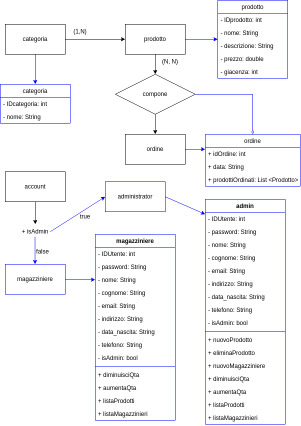

# Il progetto in breve
Nasce come sistema per gestire un magazzino di prodotti, da impiegare nel reparto logistica di una realtà aziendale. Il sistema prevede due tipologie di account: l'admin e il magazziniere. Il primo è un account riservato al responsabile di magazzino, mentre ogni magazziniere ha il proprio account con permessi limitati. Per rendere la realizzazione del programma e il suo relativo impiego il più realistico possibile, si è pensato allo sviluppo di un'applicazione a riga di comando.

In fase di progettazione si è pensato di tenere il funzionamento del sistema limitatamente al reparto di magazzino, senza avere quindi la necessità di comunicare con applicativi o basi di dati relative ad altri uffici. Questo spiega anche l'assenza di interfacce grafiche e di elementi aggiuntivi superflui quali immagini: i destinatari e gli utilizzatori dell'applicativo identificano i prodotti tramite i codici degli stessi, e sono poco interessati alle immagini o alle altre caratteristiche.

## Composizione del progetto
Il progetto si compone di una parte client basata su una interfaccia a riga di comando, e una server, rappresentata da un server db manager che utilizza i servizi WCF forniti dal .NET Framework di Microsoft. Il linguaggio di programmazione utilizzato è C#, affiancato in alcuni punti dal linguaggio SQL per l'interazione con il database che è di tipo MySQL.

# Le fasi di progettazione

## Studio di fattibilità e analisi dei requisiti
Il progetto, dovendo utilizzare tecnologie fornite da .NET Framework, doveva essere sviluppato su una macchina con sistema operativo Windows.

Unitamente all'IDE Visual Studio sono state installate le estensioni consigliate. Come sistema di gestione di database, a fronte della scelta di volerlo gestire in MySQL, è stato effettuato il download dell'applicativo XAMPP (in quanto utilizzato in un insegnamento passato).

I requisiti tecnici per lo sviluppo del progetto erano quindi soddisfatti.

## Progettazione logica
La progettazione logica parte dal riconoscimento delle entità coinvolte e dal loro posizionamento in uno schema relazionale.

Le prime entità sono risultate essere:

- Utenti
- Prodotti
- Ordini
- Categorie

Nello specifico, le prime relazioni tra entità sono risultate essere le seguenti:

- Una categoria contiene più prodotti, ma un prodotto fa parte di una sola categoria.
- Un ordine può essere composto da più prodotti, e un prodotto può essere presente in più ordini.
- Un utente del magazzino può essere un magazziniere oppure admin, e avere quindi privilegi aggiuntivi.

## Progettazione relazionale
Tenendo conto dei vincoli di integrità referenziale si è proceduto alla scelta dei campi per ogni entità, ottenendo alla fine il seguente schema logico:



In seguito alla lettura delle relazioni sopracitate, si è rivelato necessario l'inserimento di entità aggiuntive, al fine di gestire le relazioni di tipo N-N tra quelle esistenti.

- Composizione: al fine di gestire la relazione N a N tra prodotti e ordini
- Account  Amministratore: possiede un flag con un valore particolare che permette di distinguerlo in fase di login. È possibile la coesistenza di più amministratori.

Una volta incluse le entità sopracitate, unitamente alla specificazione dei campi da inserire nelle stesse, è stato possibile ottenere una bozza di schema del database:

> *In grassetto sono state indicate le chiavi primarie*
> 
> *In corsivo i vincoli di integrità referenziale sono stati tradotti in chiavi esterne*

categoria (**IDcategoria**, nome)

prodotto (**IDprodotto**, nome, descrizione, prezzo, quantita, *fk_categoria*)

ordine (**IDordine**, data)

composizione (**IDcomposizione**, *fk_prodotto*, *fk_ordine*, quantita)

account (**IDaccount**, password, nome, cognome, email, indirizzo, data_nascita,  telefono, TipoAccount)

### La traduzione in linguaggio SQL
Lo schema è stato quindi tradotto in linguaggio SQL per creare le tabelle con i campi coerenti con i tipi di dato necessarie alla corretta rappresentazione delle entità all'interno del database.

Siccome in SQL non è possibile utilizzare liste di oggetti come tipi di dato, è stata necessaria (e doverosa per la correttezza della teoria) una traduzione del campo `prodottiOrdinati` di tipo lista di prodotti. Questo aspetto è trattato dal design pattern `adapter` che come intuibile dal nome si occupa di garantire una collaborazione tra oggetti con interfacce differenti attraverso una traduzione e un adattamento.

L'immagine è alquanto esplicativa


```sql
CREATE DATABASE IF NOT EXISTS magazzino;

USE magazzino;

CREATE TABLE categoria (
  IDcategoria int(11) NOT NULL AUTO_INCREMENT PRIMARY KEY,
  nome varchar(255) NOT NULL
);

CREATE TABLE prodotto (
  IDprodotto int(11) NOT NULL AUTO_INCREMENT PRIMARY KEY,
  nome varchar(255) NOT NULL,
  descrizione text NOT NULL,
  prezzo text NOT NULL,
  quantita int(11) NOT NULL,
  fk_categoria int(11) NOT NULL,
  Foreign Key (fk_categoria) REFERENCES categoria(IDcategoria) ON DELETE CASCADE
);

CREATE TABLE ordine (
  IDordine int(11) NOT NULL AUTO_INCREMENT PRIMARY KEY,
  data date NOT NULL
);

CREATE TABLE composizione (
  IDcomposizione int(11) NOT NULL AUTO_INCREMENT PRIMARY KEY,
  fk_prodotto int(11) NOT NULL,
  fk_ordine int(11) NOT NULL,
  quantita int(11) NOT NULL,
  Foreign Key (fk_prodotto) REFERENCES prodotto(IDprodotto) ON DELETE CASCADE,
  Foreign Key (fk_ordine) REFERENCES ordine(IDordine) ON DELETE CASCADE
);

CREATE TABLE account (
  IDutente int(11) NOT NULL AUTO_INCREMENT PRIMARY KEY,
  password varchar(255) NOT NULL,
  nome text NOT NULL,
  cognome text NOT NULL,
  email text NOT NULL,
  indirizzo text NOT NULL,
  data_nascita date NOT NULL,
  telefono text NOT NULL,
  TipoAccount int(1) NOT NULL,
  Foreign Key (fk_login) REFERENCES account(IDlogin) ON DELETE CASCADE
 );
```

# I metodi
Siccome i nomi dei metodi sono abbastanza auto esplicativi, questa sezione è mirata a spiegarne le scelte e i ragionamenti che ci stanno dietro.

## Filosofia e privilegi d'accesso
Come detto in precedenza, il sistema è pensato per essere utilizzato da due tipologie di account: i magazzinieri e gli amministratori. Di conseguenza sono previsti due differenti livelli di accesso e manipolazione dei dati presenti nel database. L'accesso tradizione, di amministrazione ordinaria previsto per i magazzinieri, consente di evadere ordini, quindi di diminuire la quantità dei prodotti presenti in magazzino, così come gestire eventuali resi e di conseguenza aumentare la giacenza. I metodi non possiedono una particolare motivazione di invocazione ma si concentrano sul risultato e sulla funzione implementata. Per essere più chiari e spiegare senza troppi giri di parole, si potrebbe dire che i metodi sono pensati per **ottenere un risultato**, piuttosto che **gestire una situazione**, in quanto la valutazione è demandata al magazziniere.

In precedenza è stato fatto l'esempio della diminuzione della giacenza in seguito all'evasione di un ordine. In realtà si potrebbe pensare a un caso di un prodotto, o un lotto di prodotti che viene danneggiato o che per altri motivi non può essere venduto o tenuto in magazzino. La gestione della situazione confluirebbe comunque nella diminuzione della quantità del prodotto in questione.

<!-- esempio di codice della diminuzione e spiegazione del perché è più complessa dell'aumento -->

```csharp
//Service1.cs
public bool DiminuisciGiacenze(int id, int quantita)
{
    int attuale = 0;
    try
    {
        bool risultato = false;
        using (MySqlCommand command0 = conn.CreateCommand())
        {
            command0.CommandText = "SELECT quantita from prodotto where IDProdotto ='" + id + "'";
            using (MySqlDataReader reader = command0.ExecuteReader())
            {
                while (reader.Read())
                {
                    attuale = reader.GetInt32(0);
                }
            }

            if (attuale < quantita)
            {
                Console.WriteLine("impossibile diminuire giacenze, numero troppo alto");
                return risultato; //false perchè att < quantita e non è possibile
            }
            else
            {
                using (MySqlCommand command1 = conn.CreateCommand())
                {
                    command1.CommandText = "UPDATE prodotto SET quantita = quantita -' "
                    + quantita + " ' WHERE IDProdotto = ' " + id + " ' ";
                    
                    using (MySqlDataReader reader = command1.ExecuteReader()) ;
                }
                risultato = true;
            }
        }
        return risultato;
    }
    catch (Exception)
    {
        throw new Exception();
    }
}
```

Il metodo per diminuire la giacenza è un po' più complesso del suo gemello per aumentarla, poichè è necessario un controllo preliminare: se la quantità che si vuole sottrarre alla giacenza è maggiore di quest'ultima si avrà una situazione di errore: la disponibilità non può essere negativa. Per cui in questa caso verrà mostrato un alert e l'operazione di diminuzione sarà impedita.

Tornando alle funzionalità previste per l'utenza a privilegi base vi è quella di stampare alle informazioni di contatto (nome, mail, telefono) degli altri magazzinieri, in modo da poter conoscere i riferimenti di contatto per una eventuale necessità. Non rientrano nella stampa gli amministratori poiché è  ragionevole pensare che un responsabile sia sempre presente in magazzino e qualora dovesse assentarsi sarebbe lui a comunicarlo, oltre che per motivi di sicurezza.

I magazzinieri inoltre possono in qualunque momento ottenere una stampa dei prodotti presenti in magazzino, ma non possono cancellare le informazioni di un prodotto o aggiungerne uno nuovo.

## Metodi a privilegi elevati
Possibilità che invece è concessa agli utenti amministratori con privilegi elevati, i quali possono anche registrare e inserire nel database nuovi magazzinieri. Tuttavia non dispongono privilegi sufficienti per inserire o rimuiovere dal sistema un amministratiore: questa operazione per ragioni di sicurezza e confidenzialità è fattibile solamente da operatori di sistema che hanno accesso diretto al database, i quali agiscono su richiesta del responsabile di stabilimento.

